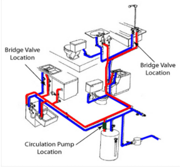

# What is p5.js

## Introduction

Every day you probably use a sink or shower to get water at a certain temperature.
You're probably even pretty good at getting exactly the temperature you want. You may know,
for example, that a 1/4 turn of the left knob and 1/2 turn of the right knob produces the perfect
temperature, not too hot and not too cold.

Even though you do this every day you may not really know anything about plumbing or
how water-heating systems work. In fact, you totally *do not need to know how those things work*
to use them in your daily routine.

That's pretty cool!

To summarize, knowing **how to use** something:


Can sometimes be very different from knowing all about **how it works** or
how it is wired up behind the scenes:


( what's even going on here ¯\\\_(ツ)_/¯ )

In your future as a programmer you will be doing both of these things. Sometimes
you will be defining the blueprints and inner-workings of how something will work.
Other times you will be using code the way you use a sink: There may be a whole
complicated system behind that code but you only need to know how to properly
turn the knobs to be a great and proficient user of that sink and get the water
temperature you desire.

## Enter p5.js

p5.js is a code **library**. A library is just a bunch of code someone else
wrote that we get to use. p5.js is written in the **JavaScript** programming language-- that's what
the `.js` stands for. When you're working on your p5.js projects you will be writing
programs with JavaScript. You've probably heard the term **program** before,
it means, simply, a collection of code that is meant to be run by a computer to perform
a specific task.

You'll be writing your first program very soon!


p5 is a great way to introduce the fundamentals of JavaScript, or
really any programming language, because it provides an easy-to-use **interface**
(you could say the knobs on a sink are the interface for a water-heating system, it's through them
that we *use and interact* with the system) backed by a powerful library that we can
use to make really cool things surprisingly quickly.

To continue with the sink analogy,
p5 sets up the whole plumbing and heating system and makes certain code available that will
allow us to use and change that system.

### What can you do with it?

With p5.js:

- You can **write code that will draw shapes and colors on the screen in a web browser**
like Google Chrome.

- You can write code that will **animate** your shapes and make them move over time.

- You can write code that will make the things you draw respond to **events**. An event is something
like the user of our program clicking or moving the mouse.

By combining different pieces of code that do these things you can build up programs that can be simple or complex, interactive
games or works of art, and you'll be able to share your programs with your friends and family
on the internet!


Here are examples of some projects built with p5.js

(TODO: pic and gif examples of things built with p5, links)

-

-

-

Let's get started drawing some shapes on the screen! Doing this will require just
a little bit of setup. Since we'll use the p5.js library in a web browser, we'll have to
look at a little HTML. Luckily, that should be no big deal to all of you :)

### Let's dive right in


Starting with an empty HTML document in cloud9, the first thing to do is
hook up our project with the p5.js library.

Try visiting `https://cdnjs.cloudflare.com/ajax/libs/p5.js/0.5.7/p5.js` in your browser.


Wow so much code! That's the p5.js library. What you have to do is tell your html file to
go that address and get all that code. You do this with a `script` tag.

JavaScript code can actually be written directly inside of a `script` tag, but since here
the code we want to use lives elsewhere, at that web address, you can use the `src` property of a `script` tag.

Paste this into the `head` tag in your `index.html` file:

```html
<script src="//cdnjs.cloudflare.com/ajax/libs/p5.js/0.5.7/p5.js"></script>
```


Great! Now when you write JavaScript you will have access to the full p5.js library. What's missing
is a place for you to write all your code.

Make a new file in the root directory of your project called `sketch.js`.

Now you need to let your html know about that file the same we we let it know about
the p5 library-- with a `script` tag. The `src`, or source, that a script tag
retrieves code from can be either a web address or another file you have locally in your project.

Paste this inside the `head` as well:

```html
  <script type="text/javascript" src="sketch.js"></script>
```


To test that everything works paste this code into your empty `sketch.js` file.

```javascript
function setup() {

}

function draw() {
  ellipse(50, 50, 80, 80);
}
```

If you see an circle on the screen when you preview your `index.html` you're good to go.


In the next lesson we can explore more what that code you just wrote is doing. Good work 👍

## Resources

- [Getting Started with p5.js](https://p5js.org/get-started/)
- [p5.js Interactive Introductory Video](http://hello.p5js.org/)
- [Coding Train](https://www.youtube.com/playlist?list=PLRqwX-V7Uu6Zy51Q-x9tMWIv9cueOFTFA)
